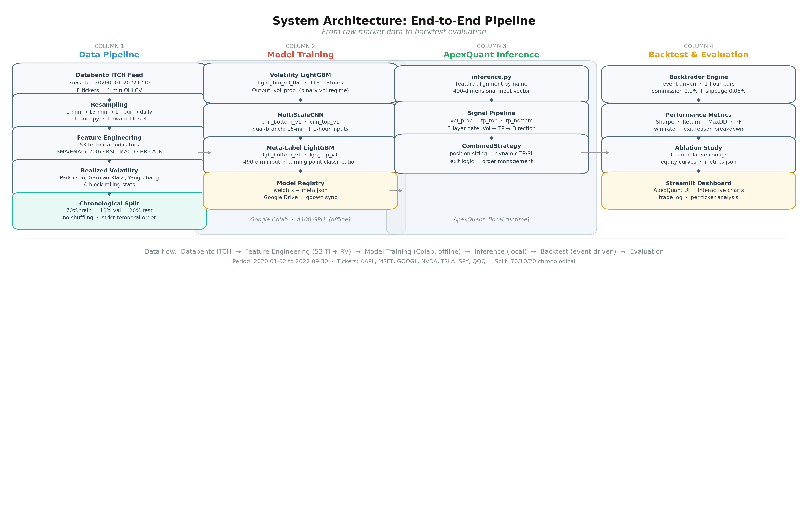

# Applying Deep Time-Series Learning to Stock Forecasting and Quant Trading

> **BSc thesis research repository.** This repo contains all training and
> analysis notebooks, the processed Databento NASDAQ ITCH dataset, and every
> model checkpoint produced by the project. The trading platform that
> consumes these models lives in a separate repo: see
> [ApexQuant](https://github.com/Heeeeeeliang/apexquant).

## Abstract

This work investigates whether deep sequence models can profitably forecast
short-horizon equity prices, and proposes a three-layer cascaded
task-decomposition framework that side-steps the empirical ceiling we observe
when the problem is posed as direct price-direction prediction. Across 9
representative methods — ranging from naïve random-walk and historical-mean
baselines, through LSTM / Attention-LSTM / Transformer-LSTM regressors, to a
foundation model (TimesFM, zero-shot and fine-tuned) — direct
price-direction accuracy on 1-hour NASDAQ bars converges to **~50%** under
strict no-leakage evaluation, regardless of architectural sophistication. We
therefore decompose the trading problem into three easier sub-tasks: (i)
realised-volatility forecasting (LightGBM, 80–84% directional accuracy on the
volatility regime); (ii) turning-point localisation (MultiScaleCNN +
meta-labelling, AUC ≈ 0.80–0.85); and (iii) trade filtering (LightGBM
gate). Composed end-to-end and back-tested on 8 NASDAQ tickers from
2020-01-07 to 2022-09-30 with realistic frictions (10 bps commission,
5 bps slippage), the system delivers **+67.2% total return, Sharpe 2.14,
maximum drawdown −9.9%, 1,908 trades, profit factor 2.17 (Run 11 — trail-stop
variant)**.

*The full thesis PDF will be added to this repository after academic
submission (post April 29, 2026). Citation details will be updated at
that time.*

---

## Central finding

> **Direct price-direction prediction hits a ~50% accuracy ceiling across 9
> representative methods under strict no-leakage conditions.**
>
> | Method (1-hour bars, 8 tickers) | DA | RMSE | R² | n |
> |---|---:|---:|---:|---:|
> | Naïve (random walk) | 0.499 | – | – | 16,181 |
> | Historical mean | 0.501 | – | – | 16,181 |
> | Linear regression | 0.501 | 2.43 | 0.983 | 16,181 |
> | LightGBM (regression) | 0.498 | 2.45 | 0.981 | 16,181 |
> | LSTM regression | 0.496 | 2.43 | 0.983 | 16,181 |
> | Attention-LSTM | 0.503 | 3.63 | 0.955 | 16,181 |
> | Transformer-LSTM | 0.498 | 2.50 | 0.980 | 16,181 |
> | TimesFM (zero-shot) | 0.501 | 2.46 | 0.982 | 16,181 |
> | TimesFM (fine-tuned, directional loss) | 0.502 | 2.48 | 0.981 | 16,181 |
>
> Source: `notebooks/01_direct_prediction_ceiling/`. None of the differences
> from 50% survive a one-sided z-test at α = 0.05 after the no-leakage
> corrections described in §Methodological notes below.

This is the empirical motivation for the three-layer decomposition that
follows.

---

## Three-layer framework



| Layer | Task | Model | Why this layer is easier than direct prediction |
|---|---|---|---|
| **1 — Volatility regime** | Forecast next-window realised volatility (regression + sign-of-trend) | LightGBM on 40 engineered features + LSTM-block embeddings | Volatility clusters; directional accuracy 80–84% (vs. 50% for price) |
| **2 — Turning points** | Localise local tops & bottoms (binary, very class-imbalanced) | MultiScaleCNN, meta-labelled with a top-/bottom-specific LightGBM filter | Reframes "where does it go next?" as "is *this* bar a structural pivot?" — a structurally rarer, locally observable event |
| **3 — Trade gate** | Decide whether the Layer-1 + Layer-2 signal warrants an actual trade | LightGBM with vol-regime, TP confidence, and trend features | Uses cross-layer agreement; final win-rate after gate ≈ 50%, but profit factor 2.17 because the gate concentrates trades into high-EV windows |

The cascade is composed left-to-right: a bar is only considered for a trade if
Layer 1 places it inside an "expansionary" volatility regime AND Layer 2 fires
a TP signal AND Layer 3 passes the trade through.

---

## Quickstart

```bash
git clone https://github.com/Heeeeeeliang/Applying-Deep-Time-Series-Learning-to-Stock-Forecasting-and-Quant-Trading.git
cd Applying-Deep-Time-Series-Learning-to-Stock-Forecasting-and-Quant-Trading

# Environment (conda)
conda env create -f environment.yml
conda activate quant-thesis

# Open the training source or the ceiling study
jupyter lab notebooks/training_source.ipynb
# or
jupyter lab notebooks/01_direct_prediction_ceiling/
```

### Without conda (pip + venv)

```bash
python -m venv .venv
source .venv/bin/activate    # Windows: .venv\Scripts\activate
pip install -r requirements.txt
```

`requirements.txt` mirrors `environment.yml` with pip equivalents.
Tested with Python 3.11. GPU users: install the CUDA-matched
`torch` wheel from <https://pytorch.org> *before* running the line
above so pip does not fall back to the CPU build.

All model checkpoints and processed datasets used in this thesis are
attached to GitHub Release v1.0.0. See `data/README.md` and
`checkpoints/README.md` for the per-artifact download commands.

Release v1.0.0 contains every artifact required to reproduce the headline
backtest (Run 11) and the ceiling study tables, with the exception of the
fine-tuned TimesFM weights — those are evaluated in this study (weights
not redistributed; reproducible from the official
[google-research/timesfm](https://github.com/google-research/timesfm) repo
together with the data and split files in this repo).

> **Reproducing the headline ceiling table.** The 9-method
> ceiling table is produced by
> `notebooks/01_direct_prediction_ceiling/03_baseline_models.ipynb`.
> See [`notebooks/01_direct_prediction_ceiling/README.md`](notebooks/01_direct_prediction_ceiling/README.md)
> for per-notebook execution order and how to reproduce the
> two TimesFM rows (which require a separate Python 3.11
> environment due to a `jaxlib` wheel constraint).

---

## Results

### Ablation — incremental contribution of each component

| # | Configuration | Total return | Sharpe | MaxDD | Trades | Win rate | PF |
|---:|---|---:|---:|---:|---:|---:|---:|
| 1 | EMA + RSI baseline | −43.6% | −1.52 | −48.0% | 2,341 | 30.7% | 0.96 |
| 2 | + Position sizing | −38.1% | −0.88 | −45.8% | 2,322 | 31.0% | 0.97 |
| 3 | TP detection only (no vol gate) | −39.1% | −1.99 | −50.3% | 3,827 | 43.5% | 1.79 |
| 4 | TP + Direction (no vol gate) | −38.9% | −1.98 | −50.1% | 3,821 | 43.6% | 1.79 |
| 5 | **+ Vol Gate** | **+24.6%** | **+1.29** | **−9.4%** | 2,021 | 45.0% | 2.02 |
| 6 | + Trend bypass | +26.2% | +1.35 | −9.3% | 2,105 | 45.0% | 2.05 |
| 7 | + Signal reversal | +25.7% | +1.36 | −10.9% | 2,126 | 47.7% | 2.13 |
| 8 | + Vol collapse | +26.2% | +1.39 | −10.8% | 2,131 | 48.0% | 2.16 |
| 9 | Tranche exit (standalone) | +36.0% | +1.19 | −17.2% | 1,785 | 39.7% | 1.76 |
| 10 | + Full + Tranche | +68.5% | +2.14 | −10.4% | 1,883 | 47.9% | 2.15 |
| **11** | **Full + Trail-Stop (final)** | **+67.2%** | **2.14** | **−9.9%** | **1,908** | **50.1%** | **2.17** |

The **63.5 pp** jump between Run 4 and Run 5 is the Vol Gate's contribution
and is the single most important component in the system.

### Headline metrics (Run 11)

| Metric | Value |
|---|---|
| Total return (2020-01-07 → 2022-09-30) | **+67.2%** |
| Annualised return | +20.6% |
| Sharpe ratio | **2.14** |
| Sortino ratio | 4.61 |
| Calmar ratio | 2.08 |
| Maximum drawdown | **−9.9%** |
| Total trades | **1,908** |
| Win rate | 50.1% |
| Profit factor | **2.17** |
| Avg bars held | 12.3 |
| Long / short trades | 192 / 1,716 |

---

## Reproduction

This repository ships every artifact required to reproduce the headline
backtest (Run 11) and the ceiling-study tables. The model checkpoints
and processed datasets are attached to **GitHub Release v1.0.0**.

### Release v1.0.0 — asset inventory

| File | Size | sha256 | Purpose |
|---|---:|---|---|
| `apexquant_data_v1.tar.gz` | 1.4 GB | `fb94e857c0918f4308956eea0f0de646050c07f90ee21a6d6baec5f5905daaa4` | Processed Databento OHLCV bars, engineered features, Layer-1 vol-data arrays, Layer-2 turning-point input windows. |
| `checkpoints-ceiling_baseline.tar.gz` | 39 MB | `5a3f1bd796b75f0be2e4ee00823f8974c52ba3dca10a5ba2cd3daf7d11677487` | 49 weights for the 9-method ceiling study (vanilla / attention / transformer LSTM). |
| `checkpoints-layer1_volatility.tar.gz` | 2.2 MB | `2fa216508f14b13a501d3a1d339ae9685361c6a35979e400c7867b1b2b794f60` | 13 Layer-1 LSTM volatility forecasters consumed by Layer 2. |
| `checkpoints-layer2_turning_point.tar.gz` | 871 KB | `428b3a2d557dcd7e768169405c0a6f17db1893270783f47f6860b53182c4644c` | 4 MultiScaleCNN top/bottom heads. |
| `checkpoints-unknown.tar.gz` | 3.3 MB | `6c1034292719ef4d0396de658583c278431cd362ee9ebf24f9e4cdfa5f34cd2f` | 9 Layer-1 / Layer-3 LightGBM weights (lightgbm_v3, lightgbm_v3_flat, lgb_top_v1, lgb_bottom_v1, lgb_v2) plus 3 exploratory 1-min LSTM checkpoints. |
| `SHA256SUMS` | 495 B | (manifest) | Aggregate hash file. `sha256sum -c SHA256SUMS` validates all five tarballs in one shot. |

### Reproduction recipe (from a fresh clone)

```bash
git clone https://github.com/Heeeeeeliang/Applying-Deep-Time-Series-Learning-to-Stock-Forecasting-and-Quant-Trading.git
cd Applying-Deep-Time-Series-Learning-to-Stock-Forecasting-and-Quant-Trading

# 1. Set up environment (Python 3.11 recommended)
python -m venv .venv
source .venv/bin/activate      # Windows: .venv\Scripts\activate
pip install -r requirements.txt

# 2. Download all release assets and verify
gh release download v1.0.0
sha256sum -c SHA256SUMS         # five lines of "OK"

# 3. Extract data into data/
tar -xzf apexquant_data_v1.tar.gz --strip-components=1 -C data/

# 4. Extract every checkpoint tarball into checkpoints/<layer>/
for tar in checkpoints-*.tar.gz; do tar -xzf "$tar"; done

# 5. Validate that 73 of 75 redistributable checkpoints load
#    (the 2 namespace-dependent exploratory files are deliberately
#     skipped — see checkpoints/README.md)
python -c "
import torch, joblib, pandas as pd
from pathlib import Path
m = pd.read_csv('checkpoints/MANIFEST.csv')
m = m[m['publish_target'] == 'github_release']
m = m[m['notes'].fillna('') != 'namespace_dependent']
assert len(m) == m['relative_path'].nunique()
errors = 0
for _, row in m.iterrows():
    path = Path('checkpoints') / row['relative_path']
    if not path.exists():
        print(f'MISSING {path}'); errors += 1; continue
    try:
        if path.suffix == '.joblib':
            joblib.load(path)
        else:
            torch.load(path, map_location='cpu', weights_only=False)
    except Exception as e:
        print(f'FAIL    {path}: {e}'); errors += 1
print(f'{len(m) - errors}/{len(m)} checkpoints loaded successfully.')
"
# Expected: 73/73 checkpoints loaded successfully.
```

The headline 9-method ceiling table is produced by
`notebooks/01_direct_prediction_ceiling/03_baseline_models.ipynb`.
See [`notebooks/01_direct_prediction_ceiling/README.md`](notebooks/01_direct_prediction_ceiling/README.md)
for per-notebook execution order and notes on the optional
Python-3.11 environment required for the two TimesFM rows.

---

## Citation

```bibtex
@thesis{li2026deepts,
  title   = {Applying Deep Time-Series Learning to Stock Forecasting and Quant Trading},
  author  = {Li, Heliang},
  year    = {2026},
  school  = {University of Leeds},
  type    = {BSc thesis}
}
```

A machine-readable form is provided in `CITATION.cff`.

---

## Methodological notes

These three details materially change the headline numbers and are easy to
get wrong; we document them explicitly so independent re-implementations
converge to the same conclusion.

### 1. VMD global decomposition leaks future information

VMD global decomposition leaks future information; directional accuracy
drops from ~85% to ~49% when decomposition is computed in a rolling window
that excludes the target bar. Full methodology is documented in the
accompanying thesis (to be published post academic submission).

### 2. Two-stage CNN → meta-label is not optional

The MultiScaleCNN at Layer 2, evaluated as a stand-alone trade signal at
threshold 0.5, picks bottoms with **48.7%** subsequent win-rate — well below
breakeven after costs. The meta-label LightGBM (Layer 3, top/bottom-specific)
takes the CNN's probability + a small set of vol- and trend-conditioning
features and recovers a 55–57% trade-conditional WR; combined with the
asymmetric stop / target produced by the dynamic-execution layer, this is what
turns the system from breakeven into Sharpe ≈ 2. Both components are
necessary; either alone is not profitable after frictions.

### 3. The Vol Gate contributes ~63 pp on its own

Removing only the Vol Gate from the final system (Run 4 → Run 5 in the
ablation table above) changes total return from **−38.9% to +24.6%** —
a 63.5 pp swing. The mechanism: the gate suppresses trade signals during
low-volatility regimes where the strategy's ATR-scaled stops are too tight
relative to noise. This single component dominates every other architectural
choice we tried, including switching the Layer-2 backbone or expanding the
feature set.

---

## Known limitations

The backtest in this repo is **not** a live-trading result, and several gaps
remain between simulator and production. We document them here rather than
hide them.

- **Slippage model.** Backtest applies a flat 5 bps slippage per fill; in
  live data, slippage is regime-dependent and worst exactly when the Vol Gate
  is letting trades through. A regime-conditional slippage model is future
  work.
- **Same-bar vs. next-bar fills.** Same-bar vs next-bar fill timing
  materially affects reported returns. Users should treat backtest numbers
  as an upper bound of what live execution would achieve. Quantitative
  sensitivity analysis is documented in the thesis.
- **Commissions.** Fixed at 10 bps + $1 minimum, modelled after a retail US
  equities broker. Not representative of institutional rates, but
  conservative for the audience this repo targets.
- **Lookahead in features.** A feature lookahead audit removed 2 features
  that exhibited future-information leakage; the remaining feature set is
  documented in `data/feature_dictionary.md`.
- **Selection of 8 tickers and the 2020–2022 window.** Both were chosen for
  Databento data availability, not for sample-period robustness. Out-of-sample
  generalisation to other regimes (e.g. 2023+ post-rate-hike) is not claimed
  and remains future work.
- **GOOG / GOOGL near-duplicate listings.** GOOG and GOOGL are dual-class
  shares of the same issuer (Alphabet), trading on the same exchange with
  near-identical price paths post the 2022 20:1 split. Both tickers are
  retained in the training set and in the Run 11 backtest as a
  within-issuer consistency check — a strategy that genuinely captures
  short-horizon predictability should produce comparable but not identical
  performance on the two listings (different market microstructure, volume
  profile, and routing). Their results should be read as cross-validation
  of a single underlying signal rather than as two independent
  observations; aggregate metrics in the headline table count both, which
  slightly inflates the effective sample size for cross-ticker statistics.
- **No live forward test.** All numbers are in-sample backtest. The
  ApexQuant repo contains the live-runner; live results will be published
  there once accumulated.

---

## Repository layout

```
.
├── README.md                              ← this file
├── LICENSE                                ← MIT
├── CITATION.cff
├── environment.yml
├── docs/
│   └── figures/                           ← exported architecture diagrams
├── notebooks/
│   ├── README.md                          ← which notebook produces which result
│   ├── 01_direct_prediction_ceiling/      ← the 9-method ceiling study
│   ├── training_source.ipynb              ← original Colab notebook that trained the shipped Layer-2 weights
│   └── training_source.md                 ← which weights this notebook produced
├── data/
│   ├── README.md                          ← data card
│   ├── splits/                            ← train/val/test indices (small, in-repo)
│   └── ...                                ← processed/, features/, tp_data/, vol_data/ ship via GitHub Release v1.0.0
├── checkpoints/
│   ├── README.md                          ← manifest + manual-download paths
│   └── ...                                ← shipped weights via GitHub Release v1.0.0
└── .gitignore
```

---

## Related work

- **ApexQuant** — the production trading platform that consumes the models
  and configs in this repo: https://github.com/Heeeeeeliang/apexquant.
- Databento. _NASDAQ TotalView-ITCH historical bars._
  https://databento.com/datasets/XNAS.ITCH
- Lopez de Prado, M. (2018). _Advances in Financial Machine Learning_.
  Wiley. — Chapter 3 (meta-labelling) is the basis for the Layer-3 trade
  filter.
- Das, R. _et al._ (2024). _A decoder-only foundation model for time-series
  forecasting_ (TimesFM). — used here as the zero-shot and fine-tuned
  baseline in the ceiling study.

## Acknowledgement of Generative AI Use

This project was developed with assistance from generative AI
tools. Claude Code (Anthropic) was used to assist with
implementation tasks: generating boilerplate, writing tests,
diagnosing bugs, and producing repository reproducibility
audits. Claude (Anthropic, web/desktop) was used as a
discussion partner for architectural decisions and for prompt
engineering. All generated code was reviewed, tested, and
integrated by the author. The research design, the three-layer
cascaded framework, the empirical findings, the model
architectures, and all results are the author's original work.
See the accompanying dissertation Acknowledgements for full
disclosure.
